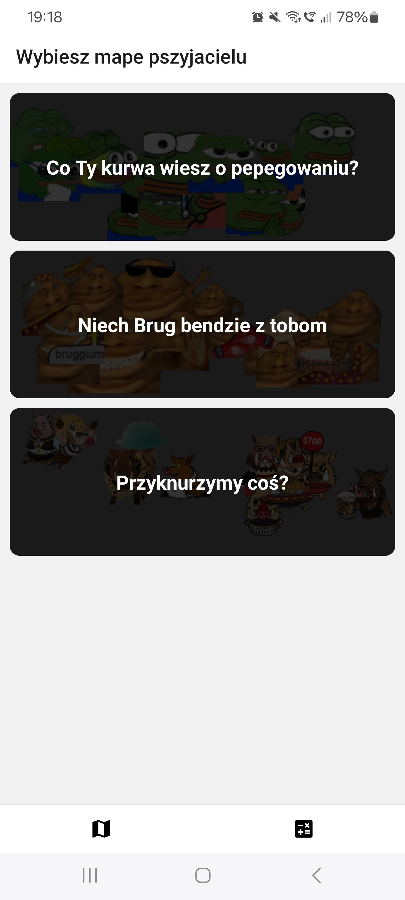
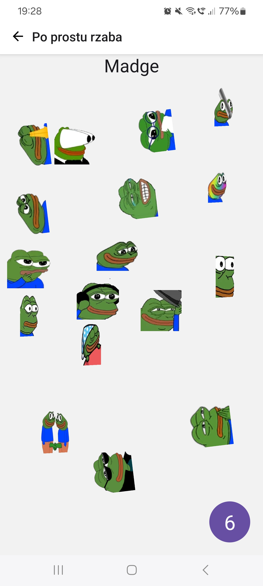
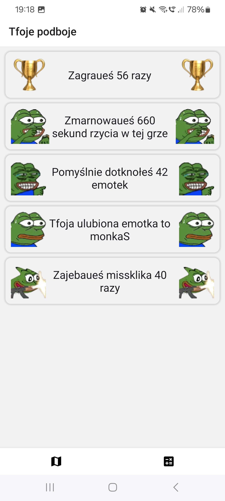

# Click Me Daddy

`Click Me Daddy` to mini gierka stworzona na konknurs organizowany przez użyszkodnika TTV [fvlvte](https://www.twitch.tv/fvlvte) (z francuskiego `fuelte`).

Nie moge potfierdzić, że działa ona na IOS, ani nie moge zapszeczyć, że działa ona na IOS, ponieważ jestem linux enjoyer i mam ajfona z androidem. Ale powinno działać, tak z grubsza, no bo przeca [React Native](https://reactnative.dev/) to jest kros-platform technologia, więc co może pujść nie tak?

## Uruchomienie aplikacji

Sprawa jest tutaj dość prosta:

1. Sklonuj sobie repo.

```sh
git clone git@github.com:Ofadiman/click-me-daddy.git
```

2. Przejdź do folderu z repo i pobierz puł NPM'a.

```sh
cd click-me-daddy && npm install
```

3. Zainstaluj se [expo go](https://expo.dev/client), albo zmarnuj kilka godzin rzycia na [konfiguracje emulatora](https://reactnative.dev/docs/environment-setup) Kappa.
4. Jak jusz to zrobiłeś to ustaw sobie czas gry. Na linuksie, albo japku możesz to zrobić wpisując w terminalu `export EXPO_PUBLIC_GAME_TIME=30`. Jak masz łindołsa to jesteś w dupie, sorry.
5. Wiem, że się już niecierpliwisz, ale mam dla Ciebie dobrom informacje. Możesz sobie odpalić apkę w trybie dev przez `npm start`.

## Gejmplej

Na ekranie startowym zostaniesz powitany listom dostempnych map, w kture możesz sobie zagrać:

<p align="center">
  
</p>

Jak jusz zdecydujesz się, w co chcesz sobie poklikać jak maupa to wyświetli Ci się ekran gry:

<p align="center">
  
</p>

Gierka może trwać tyle ile tylko sobie wymarzysz, bo jest to konfigurowalne envem. Po zakończonej grze możesz zagrać ponownie, albo wrucić do ekranu z wyborem map.

Jak jusz się trochę nagrałeś to pewnie chciaubyś wiedzieć, ile czasu zmarnowaueś w tej useless grze (ja bym chciał, bez Kappy). Na szczenście twurcy gry przewidzieli taki przypadek i stworzyli ekran ze wszystkimi statystkami jakie tylko mogłeś sobie wysmażyć. Tutaj dowiesz się:

- Ile gier zagraueś.
- Ile sekund rzycia zmarnowaueś na graniu.
- Ile emotek udało Ci się kliknonć poprawnie.
- Jaka jest tfoja ulubiona emotka.
- Ile razy zajebaueś missclicka.

<p align="center">
  
</p>
